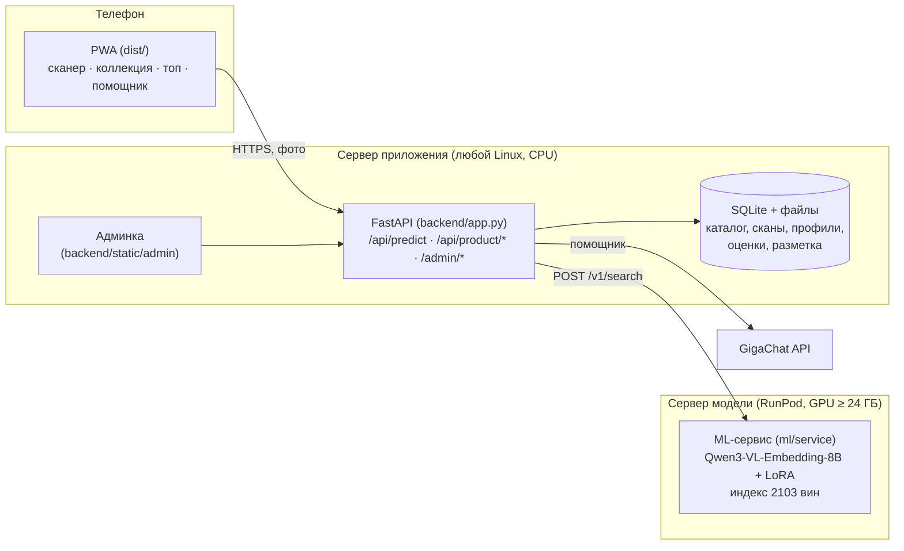

# «Своё Вино» — сканер российских вин

Веб-приложение для платформы «Своё Вино» (кейс РСХБ.Цифра, ЛЦТ 2025): наводишь камеру телефона на
бутылку — приложение за пару секунд находит это вино в каталоге из **2103 российских вин**, показывает
карточку, похожие вина, подбирает вино к ужину и помогает вести личную коллекцию.

| | |
|---|---|
| Точность распознавания (379 реальных фото с полки) | **93.4%** с первого раза, **98.9%** — в пятёрке вариантов |
| Время распознавания | ~1 с на GPU |
| Каталог | 2103 вина, 100% покрыты эталонными фото |
| Клиент | PWA: работает в браузере телефона, ставится на главный экран, без магазина приложений |

## Что умеет приложение

- **Сканер.** Снимок камерой или фото из галереи → карточка вина (винодельня, регион, сорт, цвет,
  описание) и 4 похожих вина на случай, если модель ошиблась. Если на фото нет вина — честное
  «не распознано» вместо случайной карточки.
- **Коллекция.** Избранное и личные оценки вин; последние сканы сохраняются на телефоне и доступны без
  интернета.
- **Топ вин.** Рейтинги по всем пользователям: «Чаще сканируют» и «Выше оценивают».
- **Помощник.** Подбор вина к блюду («Подобрать к ужину», «К сырной тарелке», «Белое сухое к рыбе»),
  рецепты, рекомендации «в моём вкусе» по оценкам и избранному. Работает на GigaChat; без ключа —
  подбор по каталогу.
- **Админка** (`/admin/`). История всех сканов с исходным предсказанием и ручной разметкой, разметка
  собственных фото по винам, проверка фото в папках каталога, разметка границ этикетки, разбор
  дублей каталога, выгрузка датасета в ZIP (фото + JSON / YOLO-разметка).

## Архитектура



Приложение разделено на два сервиса, чтобы дорогой GPU был нужен только модели:

1. **Сервер приложения** — `backend/` (FastAPI) отдаёт фронтенд `dist/` и API с одного адреса. Хранит
   каталог (`seed/catalog.csv`), SQLite-базу (сканы, профили, оценки, разметка) и фото. Работает на
   обычном VPS без GPU; ключи GigaChat и токен модели остаются на сервере и не попадают в браузер.
2. **Сервер модели** — `ml/` на GPU (RunPod). Принимает фото, возвращает slug, 4 альтернативы,
   уверенность и признак «вина нет». Браузер к нему напрямую не обращается — только через
   `backend/ml_client.py`.

### Путь одного скана

```
камера → PWA → POST /api/predict (backend)
       → проверка и сохранение снимка в историю
       → POST {RUNPOD_URL}/v1/search (ml): эмбеддинг фото → ближайшие вина в индексе
       ← slug + 4 альтернативы + уверенность + no_wine
       → обогащение карточек из каталога (фото, описание, оценки пользователя)
       ← карточка вина в приложении
```

### Как распознаётся вино

Мультимодальный эмбеддер **Qwen3-VL-Embedding-8B**, дообученный нами LoRA-адаптером на парах «реальное
фото ↔ фото каталога» с трудными негативами (соседние вина одной винодельни). Модель сама читает
этикетку — производителя, сорт, сладость, год. Фото целиком сравнивается с 4093 эталонными фото
каталога (у вина несколько ракурсов, берётся лучшее совпадение). Реранкеры, LLM-«читатель» этикетки и
вырезка этикетки детектором проверены и отклонены — они ухудшали точность.

Подробно — [`ml/README.md`](ml/README.md): результаты, эксперименты, обучение, API модели.

## Запуск

### 1. Сервер модели (GPU)

Linux с NVIDIA GPU от 24 ГБ видеопамяти (проверено на RunPod, A100 80GB, образ PyTorch 2.8):

```bash
git clone https://github.com/zoLikeCode/lct_2025_wine.git && cd lct_2025_wine/ml
bash setup.sh     # зависимости, адаптер и индекс, веса модели (~17 ГБ)
bash start.sh     # сервис модели на :8080
```

На RunPod откройте порт 8080 (Expose HTTP Ports) — модель будет доступна по
`https://<POD_ID>-8080.proxy.runpod.net`. Подробно — [`ml/service/DEPLOY.md`](ml/service/DEPLOY.md).

### 2. Сервер приложения

Linux с Python 3.10–3.13, GPU не нужен:

```bash
git clone https://github.com/zoLikeCode/lct_2025_wine.git && cd lct_2025_wine
RUNPOD_URL=https://<POD_ID>-8080.proxy.runpod.net bash start.sh
```

Первый запуск создаёт окружение, чистую базу с каталогом и пароль админки (выводится один раз, хранится в
`.env`). Приложение — `http://127.0.0.1:8100`, админка — `/admin/`, проверка — `/health`. Для камеры
телефона и установки PWA нужен HTTPS (обратный прокси, например Caddy). GigaChat подключается ключами в
`.env` (см. `.env.example`). Все переменные, перенос данных и HTTPS — [`docs/portable.md`](docs/portable.md).

### 3. Проверка распознавания скриптом организаторов

```bash
./participant_test.sh --images-dir ./queries --manifest ./queries.tsv \
  --endpoint 'http://127.0.0.1:8080/v1/eval/predict' --output ./predictions.jsonl
```

Результат прогона — [`ml/eval_results/`](ml/eval_results/).

## API

**Приложение** (`backend`, тот же адрес, что и фронтенд):

| Метод | Путь | Что делает |
|---|---|---|
| `POST` | `/api/predict` | скан: фото → вино, альтернативы, `no_wine` |
| `GET` | `/api/status` | готова ли модель |
| `GET` | `/api/product/search?q=` | поиск по каталогу |
| `GET` | `/api/product/wines/{slug}` | карточка вина |
| `POST` | `/api/product/preferences/{slug}` | избранное и оценка |
| `GET` | `/api/product/ranking?mode=scans\|rating` | топ вин |
| `GET` | `/api/product/recommendations` | рекомендации по вкусу |
| `GET` | `/api/product/history` | история сканов пользователя |
| `POST` | `/api/product/assistant` | помощник: подбор к блюду, рецепт, вопросы о вине |
| | `/admin/api/*` | админка (по паролю) |

**Модель** (`ml/service`, GPU):

| Метод | Путь | Что делает |
|---|---|---|
| `POST` | `/v1/eval/predict` | фото → `{"slug": "..."}` (контракт скрипта оценки) |
| `POST` | `/v1/search` | фото → slug, карточка, 4 альтернативы, уверенность, `no_wine` |
| `GET` | `/health` | состояние и размер индекса |

Фото в обоих сервисах передаётся как `multipart/form-data` в поле `image`.

## Структура репозитория

```
dist/                  готовый фронтенд (PWA): HTML, CSS, JS, service worker, иконки
backend/               API приложения (FastAPI): app.py, product.py (коллекция, топ, рекомендации,
                       помощник), ml_client.py (клиент модели), gigachat_client.py, data_store.py,
                       exports.py (выгрузка датасета), duplicates.py, static/admin (админка)
seed/                  каталог 2103 вин для чистого запуска
bootstrap_dataset.py   создание пустой базы и структуры данных при первом запуске
start.sh               запуск приложения (venv, база, пароль админки, uvicorn)
source/                исходники: wine_server (сервер, тесты, деплой nginx/systemd, сборка архива),
                       wine_curation (инструменты разметки), wine_dataset (сбор каталога и фото)
wine_curation/         модуль разметки, используемый сервером
ml/                    распознавание: обучение модели, индекс, ML-сервис, эксперименты,
                       результаты оценки — см. ml/README.md
docs/portable.md       подробная инструкция по развёртыванию приложения и переносу данных
```

## Данные

- **Каталог:** 2103 уникальных вина из выгрузки «Своё Вино». Фото собраны с карточек vino-svoe.ru и
  других источников (`source/wine_dataset/collector`), проверены вручную в админке и инструментах
  `wine_curation`; для 20 вин без фото эталоны найдены вручную, у 16 вин исправлены чужие фото.
- **Тест модели:** 379 реальных фото с полок магазинов (команда + организаторы), не пересекаются с
  обучением и индексом.
- Пользовательские сканы, база, разметка и секреты в репозиторий не входят.

## Команда

Александр Крылов, Никита Зонтов, Никита Мещеряков.
