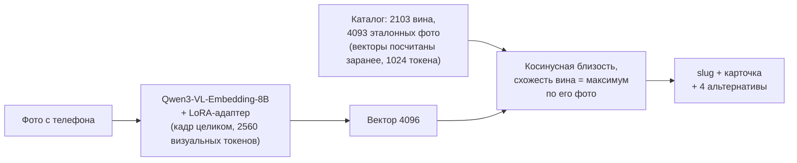

# Сканер российских вин

Поиск вина в каталоге по фотографии бутылки для платформы «Своё Вино» (кейс РСХБ.Цифра, ЛЦТ 2025).
Пользователь фотографирует бутылку на полке — сервис за ~1 секунду находит это вино среди **2103
позиций каталога** и возвращает его `slug`, карточку и ближайшие альтернативы.

| | |
|---|---|
| **Точность top-1** на 379 реальных фото с полки | **93.4%** |
| Правильное вино в top-5 | **98.9%** |
| Время ответа на GPU (A100) | ~1.1 с |
| Покрытие каталога | 2103 из 2103 вин |
| Модель | Qwen3-VL-Embedding-8B + наш LoRA-адаптер |

## Быстрый старт

Нужен Linux с NVIDIA GPU от 24 ГБ видеопамяти и PyTorch с CUDA (проверено на образе RunPod PyTorch 2.8, A100 80GB).

```bash
git clone https://github.com/zoLikeCode/lct_2025_wine.git && cd lct_2025_wine
bash setup.sh     # зависимости, LoRA-адаптер и индекс (Google Drive), веса модели (HuggingFace, ~17 ГБ)
bash start.sh     # сервис на :8080 — порт открывается, когда модель загружена и прогрета (~1–2 мин)
```

```bash
curl -F image=@photo.jpg http://127.0.0.1:8080/v1/eval/predict
# {"slug": "kokur-suhoe-2025"}
```

Скрипт оценки организаторов запускается против этого сервиса без изменений:

```bash
./participant_test.sh --images-dir ./queries --manifest ./queries.tsv \
  --endpoint 'http://127.0.0.1:8080/v1/eval/predict' --output ./predictions.jsonl
```

Результат прогона — в [`eval_results/`](eval_results/). Подробности развёртывания, переменные
окружения и сборка офлайн-пакета — [`service/DEPLOY.md`](service/DEPLOY.md).

## API

Фото передаётся как `multipart/form-data` в поле `image` (jpg / png / webp, снимок с телефона как есть).

| Метод | Путь | Ответ |
|---|---|---|
| `POST` | `/v1/eval/predict` | `{"slug": "..."}` — контракт скрипта оценки |
| `POST` | `/v1/search` | slug + карточка вина + 4 альтернативы + уверенность + признак «вина нет» |
| `GET` | `/health` | `{"status": "ok", "backend": "qwen", "catalog_size": 2103, ...}` |
| `GET` | `/docs` | Swagger UI — загрузить фото из браузера |

<details>
<summary>Пример ответа <code>/v1/search</code></summary>

```json
{
  "slug": "kokur-suhoe-2025",
  "no_wine": false,
  "card": {"slug": "kokur-suhoe-2025", "name": "Кокур Сухое, 2025", "winery": "Винодельня Братьев Мельниковых",
           "region": "...", "grape": "...", "category": "...", "color": "...", "description": "...", "score": 0.93},
  "alternatives": [{"slug": "...", "name": "...", "score": 0.88}],
  "confidence": {"top1_score": 0.93, "gap_top1_top2": 0.05},
  "latency_ms": 1100
}
```

`alternatives` — ещё 4 ближайших вина (верное вино в top-5 в 98.9% случаев), `no_wine: true` — на фото,
скорее всего, нет вина (схожесть с лучшим вином ниже 0.60). CORS открыт — фронт может звать сервис из браузера.
</details>

## Как это работает



1. **Эмбеддер.** [Qwen3-VL-Embedding-8B](https://huggingface.co/Qwen/Qwen3-VL-Embedding-8B) — мультимодальная
   модель, которая сама читает мелкий текст этикетки (производитель, сорт, сладость, год). Мы дообучили
   LoRA-адаптер (r=32, 87M параметров, ~25 минут на A100) контрастивным лоссом с трудными негативами —
   соседями по линейке той же винодельни.
2. **Индекс с несколькими фото на вино.** Основное фото каталога плюс дополнительные ракурсы (бутылка,
   фронтальная этикетка). Схожесть вина — лучшее совпадение среди его фото. Это дало **+3.4 п.п.**
   (14 исправлено / 1 сломано на тех же кадрах).
3. **Асимметричное разрешение.** Эталон — студийное фото, где этикетка на весь кадр (1024 токена
   достаточно); запрос — снимок полки, где этикетка мелкая (2560 токенов).
4. **Без детекции и реранкера.** Кадр подаётся целиком: вырезание этикетки YOLO и реранкеры проверены
   и ухудшают результат (см. ниже).
5. **Новое вино добавляется без переобучения:** фото в индекс → `python qwen_finetune/build_index.py`
   (кодирует только новые фото, секунды).

## Качество

### Тест: 379 реальных фото с полки

Фото сняты в магазинах командой и организаторами, 137 вин; ни одно не участвовало в обучении и в индексе.

| Набор | Кадров | top-1 |
|---|---:|---:|
| Фото команды | 201 | 96.5% |
| Новые фото команды | 122 | 86.1% |
| Фото организаторов | 24 | 95.8% |
| **Уникальные кадры (по SHA-256)** | **347** | **92.8%** |
| …если дубли каталога считать одним вином | 347 | 94.2% |
| Все 379 кадров (32 кадра организаторов лежат в двух наборах) | 379 | **93.4%**, top-5 98.9% |

Замер сделан сквозным прогоном через HTTP (`service/check_service.py`) — тем же способом, что скрипт
организаторов.

### Независимая проверка: 30 фото, которых модель не видела

Случайные фото 30 разных вин из магазинов и интернета, не входящие ни в обучение, ни в индекс, ни в
тест: **27/30 top-1, 30/30 top-5**. Два из трёх «промахов» — дубли каталога (одна бутылка под двумя
slug: `Гай-Кодзор Совиньон Блан` / `Sauvignon Blanc de Gaï-Kodzor`, два slug «Эстер» у одной
винодельни), третий — соседнее вино той же линейки (верный ответ вторым).

### Где ошибается

Почти все ошибки — соседи по линейке одной винодельни с почти одинаковыми этикетками (Бельбек Мускат /
Пино Нуар, KAFFA Каберне Фран / Саперави, Собер Баш Ркацители / Рислинг). В 21 из 25 ошибок на тесте
верное вино стоит в top-5 — интерфейс показывает альтернативы.

## Что пробовали

Все сравнения — попарно на одних и тех же кадрах, правило значимости
`|исправлено − сломано| ≥ 2·√(исправлено + сломано)`.

| Подход | Результат | Решение |
|---|---|---|
| SigLIP2 so400m + индекс по фото каталога | 88–89% на полевых фото | прежняя версия ([docs/siglip2_pipeline.md](docs/siglip2_pipeline.md)) |
| Qwen3-VL-Embedding-8B + LoRA | +5–7 п.п. к SigLIP2 | **в проде** |
| Несколько фото на вино в индексе | +3.4 п.п., значимо | **в проде** |
| Запрос 2560 токенов вместо 1024 | значимо лучше | **в проде** |
| Реранкер Qwen3-VL-Reranker-8B по top-5 | 3 исправлено / 10 сломано, ×5 медленнее | отклонён |
| LLM «читает этикетку» (Qwen3-VL-8B-Instruct) | 82.6%, уверенно ошибается | отклонён |
| Вырезать этикетку детектором YOLO11 | 81.8% — теряется контекст бутылки | отклонён |
| Дообучение на 305 интернет-фото (v3) | 93.1% против 93.4% | отклонён |
| Интернет-фото как доп. эталоны | 0 изменений | отклонён |
| Центроиды, CSLS, среднее top-2 по индексу | не лучше максимума | отклонены |

Полная история экспериментов, включая отрицательные результаты, — [`docs/findings.md`](docs/findings.md);
отчёт по GPU-прогонам — [`qwen_finetune/STATUS_gpu_runs_20260929.md`](qwen_finetune/STATUS_gpu_runs_20260929.md);
обучение адаптера — [`qwen_finetune/README.md`](qwen_finetune/README.md).

## Данные

- **Каталог:** 2103 вина. Для 20 вин без фото эталоны найдены вручную; у 16 вин в каталоге стояло фото
  другого вина (например, у Az Abrau Баяншира — фото Мадрасы) — чужие фото исключены
  ([`qwen_finetune/ref_conflicts.csv`](qwen_finetune/ref_conflicts.csv)), для этих вин найдены свои.
- **Дубли каталога:** 55 групп (115 slug), где одна бутылка записана под разными slug — отличаются только
  годом, крепостью или написанием ([`data_prep/catalog_duplicates.csv`](data_prep/catalog_duplicates.csv)).
  По фото их не различить.
- **Тест** собран до прогонов, дедуплицирован по SHA-256, не пересекается с обучением и индексом
  (проверено по хэшам); правки разметки — с обоснованием в
  [`data_prep/field_label_corrections.csv`](data_prep/field_label_corrections.csv).
- **«Вина нет на фото»:** порог 0.60 на схожесть с лучшим вином — 0 из 379 фото вина потеряно,
  147 из 152 посторонних фото отсечено. В `/v1/eval/predict` выключен по умолчанию
  (`NO_WINE_THRESHOLD=0.60` включает).

## Структура репозитория

```
setup.sh, start.sh     установка и запуск сервиса с чистого клона
service/               HTTP-сервис (FastAPI): app.py, qwen_finder.py (поиск), check_service.py (сквозная
                       проверка), make_bundle.sh / run_prod.sh (офлайн-пакет), DEPLOY.md
qwen_finetune/         модель: обучение LoRA (train_v2.py), индекс (build_index.py), все эксперименты
                       на GPU (hires / rerank / exp / reader / v3 / nowine), отчёты и логи в results/
data_prep/             каталог: сопоставление фото и slug, дубли, правки разметки теста
retrieval/             прежний пайплайн SigLIP2 и эксперименты эпохи SigLIP2
roboflow/              детектор этикетки YOLO11 (эксперимент, в прод не вошёл)
docs/                  findings.md — все эксперименты; ML_FOR_DECK.md — выжимка для презентации;
                       siglip2_pipeline.md — инструкции прежнего пайплайна
eval_results/          прогон скрипта оценки организаторов
```

Тяжёлые артефакты в git не хранятся: LoRA-адаптер, индекс и карточки вин собраны в `wine_prod.tar`
(Google Drive, скачивается `setup.sh`), веса Qwen3-VL-Embedding-8B — с HuggingFace.

## Ограничения

- Нужен GPU: модель 8B в bf16 занимает ~18 ГБ видеопамяти; на CPU в 3 секунды не укладывается.
- Дубли каталога (одна бутылка под несколькими slug) по фото неразличимы — это свойство каталога.
- Слабое место — вина одной линейки с почти одинаковыми этикетками; дальнейший рост упирается в
  реальные фото таких бутылок, а не в модель (дообучение на интернет-фото прироста не дало).

## Команда

Александр Крылов, Никита Зонтов, Никита Мещеряков.
